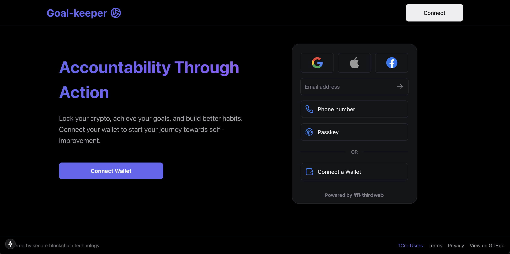
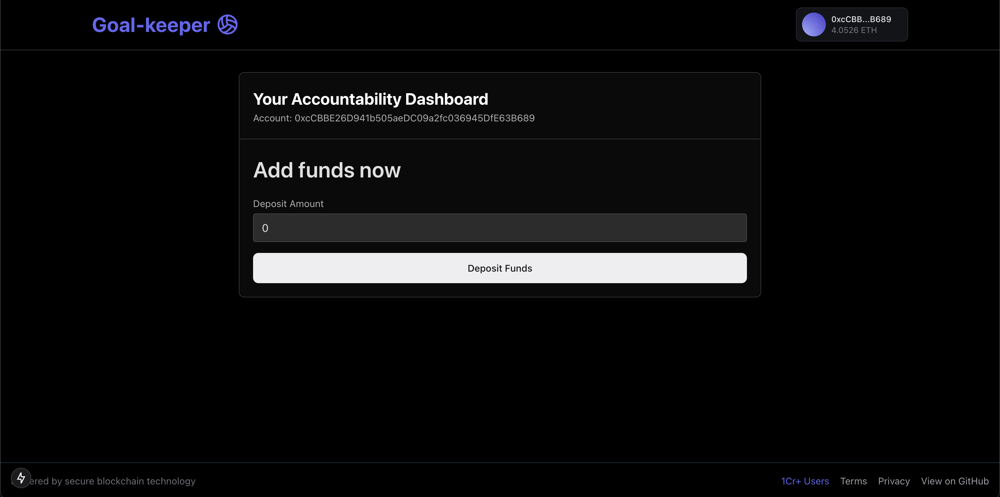
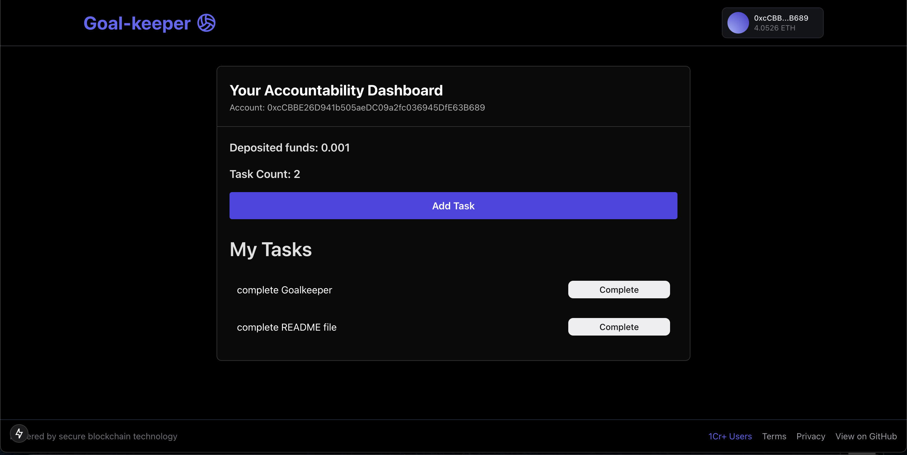
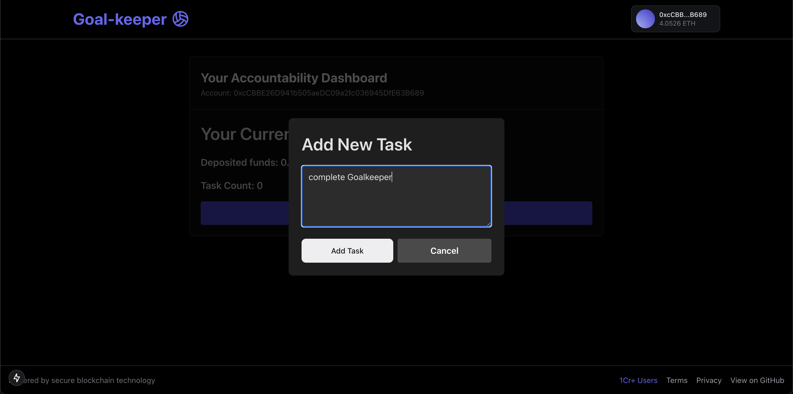
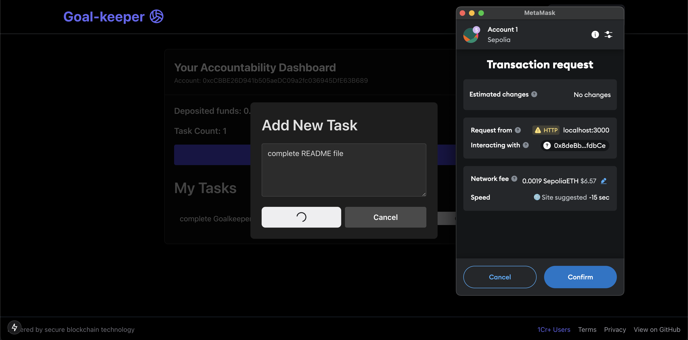
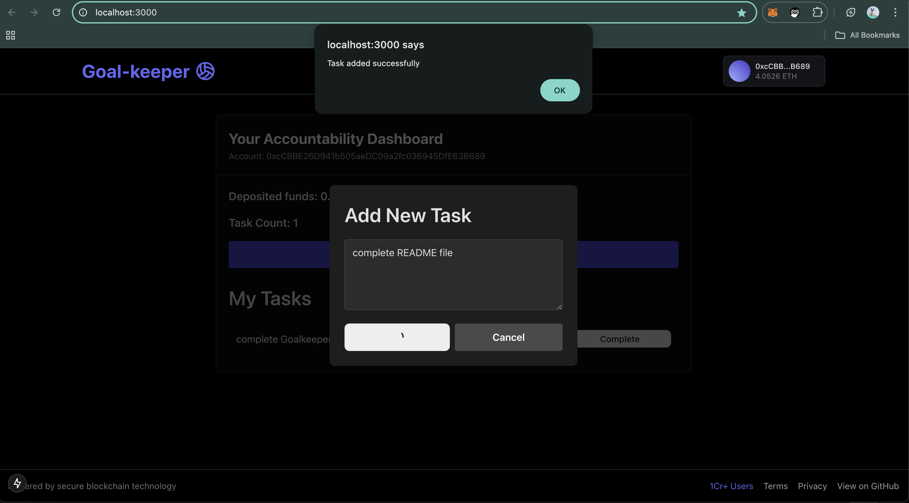
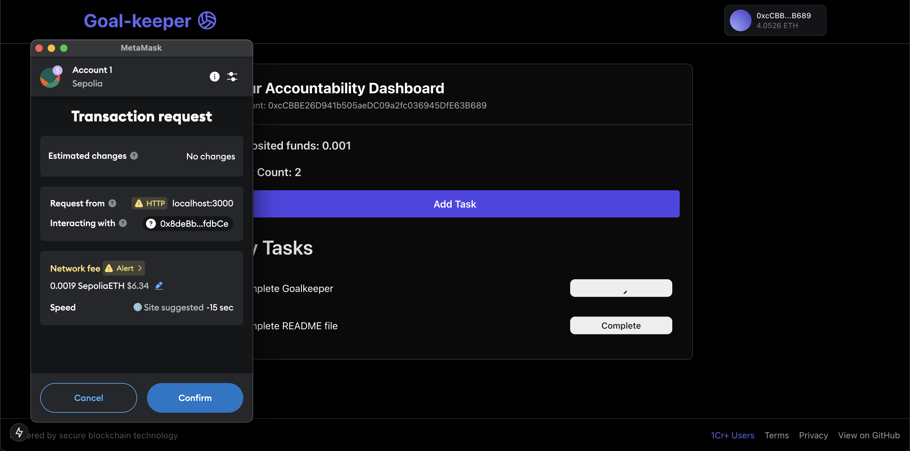
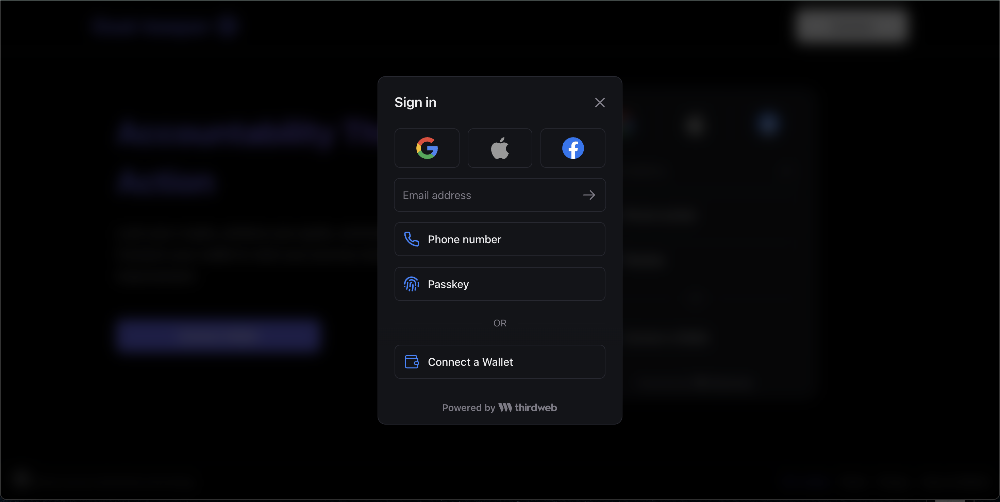

# GoalKeeper  

<div align="center">
  
  
  
  
  
  
</div>


GoalKeeper is a blockchain-powered task management application that incentivizes productivity. Users can deposit funds and assign tasks, and upon completing all tasks, they retrieve their deposited funds.



## Features  
- **Task Management**: Add, update, and track tasks.  
- **Blockchain Integration**: Secure fund deposits and withdrawals using smart contracts.  
- **Incentivized Workflow**: Complete tasks to unlock deposited funds.  

---



## Tech Stack  
- **Frontend**: [Next.js](https://nextjs.org/), TypeScript, [Tailwind CSS](https://tailwindcss.com/)
- **Blockchain Frameworks**: [ThirdWeb](https://thirdweb.com/), [Hardhat](https://hardhat.org/)  
- **Smart Contracts**: Solidity  



---






## Prerequisites  
- Node.js (>= 16.x)  
- Yarn or npm  
- MetaMask or compatible wallet  
- ThirdWeb account  

---

## Getting Started  

### 1. Clone the Repository  
```bash  
git clone https://github.com/Aytaditya/Web3-GoalKeeper
cd Web3-GoalKeeper
```  

### 2. Install Dependencies  
```bash  
yarn install  
# or  
npm install  
```  

### 3. Set Up Environment Variables  
Create a `.env.local` file in the root directory and add the following variables:  
```env  
NEXT_PUBLIC_THIRDWEB_PROJECT_ID=your_thirdweb_project_id  
```  

### 4. Run the Development Server  
```bash  
yarn dev  
# or  
npm run dev  
```  
The application will be accessible at `http://localhost:3000`.  

### 5. Deploy Smart Contracts  
1. Navigate to the `contracts/` directory.  
2. Deploy the contracts using Hardhat:  
   ```bash  
   npx thirdweb deploy -k SECRET_KEY
   ```  


### 6. Configure ThirdWeb  
Add your deployed contract address to the ThirdWeb dashboard and update the configuration in the app.  

---

## Usage  
1. **Connect Wallet**: Log in with your wallet using MetaMask.  
2. **Add Tasks**: Enter tasks with descriptions.  
3. **Deposit Funds**: Add funds that will be held in the smart contract until tasks are completed.  
4. **Complete Tasks**: Mark tasks as completed to withdraw funds.  

---


## Folder Structure  
 ``` 
GoalKeeper/  
├── goalkeeper/            # Blockchain-related files  
│   ├── contracts/         # Smart contracts (Hardhat)  
│   │   └── Contract.sol   # Main Solidity contract  
│   └── scripts/           # Deployment scripts  
└── client/                # Next.js client application  
    ├── public/            # Static assets  
    ├── src/  
    │   ├── components/    # Reusable components  
    │   ├── pages/         # Application routes  
    │   ├── styles/        # Global styles (includes Tailwind configuration)  
    │   ├── utils/         # Utility functions  
    │   └── hooks/         # Custom React hooks  
 ``` 

---

## Smart Contract Overview  
- **Contract.sol**  
  - Handles task creation, fund deposits, and withdrawals.  
  - Interacts with ThirdWeb for seamless integration.  

---



## Deployment  
- Frontend: Deploy the application on [Vercel](https://vercel.com/).  
- Smart Contracts: Deploy on supported blockchain networks (e.g., Polygon, Ethereum).  

---

## Contributing  
Contributions are welcome! Feel free to open issues or submit pull requests.  

---


## Contact  
- **Author**: Aditya Aryan  
- **Email**: adityaaryan531@example.com  
- **GitHub**: [Aytaditya](https://github.com/Aytaditya)  
```

